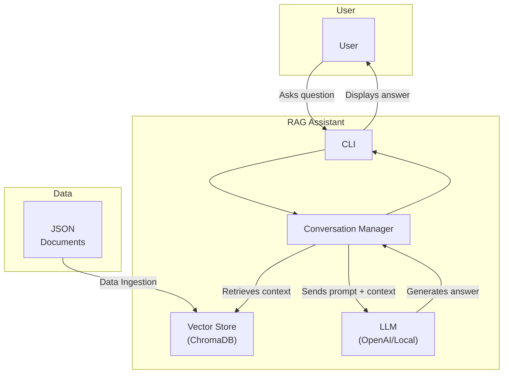

# Personal Publications RAG Assistant: A CLI-Based Document Query System

## Metadata

- **Version**: 1.0.0
- **License**: MIT
- **Language**: Python 3.8+
- **Dependencies**: LangChain, ChromaDB, HuggingFace Transformers, OpenAI API

### Overview

#### TL;DR

This project implements a basic Retrieval-Augmented Generation (RAG) assistant. It uses a vector store to find relevant documents and an LLM to generate answers based on that context. The user can interact with it through a command-line interface, add new documents, and choose from different local or remote LLMs.

#### Motivation

The goal of this project is to create a simple, easy-to-understand RAG assistant that can be extended and modified. It serves as a learning tool for understanding the core concepts of RAG and as a foundation for building more complex conversational AI applications. The motivation is to provide a clear and concise example of how to build a RAG system from scratch.

### System Architecture

#### Abstraction

This is a command-line RAG application that answers questions based on a provided set of documents. It is built with Python and leverages LangChain for interacting with LLMs and a vector store. The core components are:

- **Vector Store**: Uses ChromaDB to store and retrieve document embeddings. It employs a HuggingFace model for creating embeddings.
- **LLM Client**: Connects to both local (via Ollama) and remote (via OpenAI) language models.
- **Conversation Manager**: Handles the main chat loop, maintains conversation history, and orchestrates the RAG pipeline.
- **CLI**: A simple command-line interface for user interaction.

#### Architecture Diagram



### User Guide

#### Instructions for Use

1.  **Activate virtual environment**:
    Before you begin, make sure to activate your Python virtual environment.
    ```bash
    source venv/bin/activate
    ```
2.  **Install dependencies**:
    ```bash
    pip install -r requirements.txt
    ```
3.  **Set up environment variables**:
    Create a `.env` file in the root directory and add your OpenAI API key:
    ```
    OPENAI_API_KEY="your-api-key"
    ```
4.  **Add data**:
    Place your JSON files with publications in the `data/` directory. The JSON file should be an array of objects, with each object having `id`, `title`, and `publication_description` keys.
5.  **Run the application**:
    ```bash
    python src/main.py
    ```
6.  **Interact with the assistant**:
    - The application will first ask you if you want to manage the vector store or start a conversation.
    - If you choose to manage the vector store, you can add new publications, check the number of documents, or clear the store.
    - If you choose to start a conversation, you'll be prompted to select an LLM, and then you can start asking questions.

### Implementation Details

#### Methodology

The application follows a standard RAG pipeline:

1.  **Data Ingestion**: The user can add publications from JSON files. The text from these publications is chunked into smaller pieces.
2.  **Embedding**: A HuggingFace sentence-transformer model (`all-MiniLM-L6-v2`) is used to create vector embeddings for each text chunk.
3.  **Vector Storage**: The embeddings and the corresponding text chunks are stored in a persistent ChromaDB collection.
4.  **Retrieval**: When the user asks a question, the same embedding model is used to create an embedding for the query. The application then queries the vector store to find the most similar text chunks (based on cosine similarity).
5.  **Generation**: The retrieved text chunks are used as context for a language model. The application uses a prompt template to combine the context and the user's question, and then sends it to the selected LLM (either local or OpenAI) to generate an answer.
6.  **Conversation Memory**: The conversation history is stored in a JSON file to maintain context throughout the session.
7.  **Dependency Injection**: The application uses a dependency injection framework to manage and inject dependencies, such as the vector store, into different components. This promotes a modular and testable architecture.

#### Text Chunking Strategy

The project uses `RecursiveCharacterTextSplitter` from LangChain to divide documents into smaller chunks. This splitter is configured to create chunks of approximately 1000 characters with a 200-character overlap. This method is effective because it attempts to split text along natural semantic boundaries, such as paragraphs and sentences, which helps to keep related concepts within the same chunk. The overlap between chunks ensures that context is not lost at the boundaries.

### Project Governance

#### Safety Measures

The primary safety mechanism in this project is a set of prompt-based guardrails defined in the `prompt.yaml` file. This configuration instructs the assistant on its designated role, tone of voice, and how to behave when it cannot find a confident answer, thereby reducing the chance of generating fabricated information. The current version does not implement explicit content filtering for user inputs or retrieved documents.

#### Versioning

This project follows Semantic Versioning (e.g., MAJOR.MINOR.PATCH) to track and manage changes.

#### Maintenance and Support

This project is maintained for demonstration purposes. Support is provided on a best-effort basis as this is a personal project.

### Conclusions

This project is a simple demonstration of a RAG assistant. Working with it revealed a few key insights:

- Using "dumber" local models is highly beneficial for development. It forces more careful prompt engineering and tuning of the retrieval process, as the model is less likely to generate correct answers without accurate context.
- The current implementation always queries the vector store. A valuable future improvement would be to introduce a decision-making agent. This agent could determine whether a user's query requires a database search or if it can be answered directly, making the assistant "smarter" and more efficient.

### Future Improvements

#### Query Processing Intelligence

- **Intent Classification**: Determine if queries need document retrieval or direct answers
- **Query Expansion**: Use synonyms and query rewriting for better document matching
- **Multi-query Generation**: Create multiple search variations from complex queries

#### Performance & Monitoring

- **Retrieval Metrics**: Implement Precision@K, Recall@K, and MRR for systematic evaluation
- **Usage Analytics**: Track query patterns and document access frequency
- **Response Time Monitoring**: Log and optimize retrieval and generation latency

#### Testing Query Results

- **Test Query Dataset**: Create standardized test queries with expected document retrievals
  - Example: "What are the main findings about machine learning?" → Expected: Publications containing ML research results
  - Example: "Who are the authors of neural network papers?" → Expected: Author names from relevant publications
- **Automated Testing**: Regular evaluation of retrieval accuracy against ground truth
- **Regression Testing**: Ensure system changes don't degrade existing query performance
